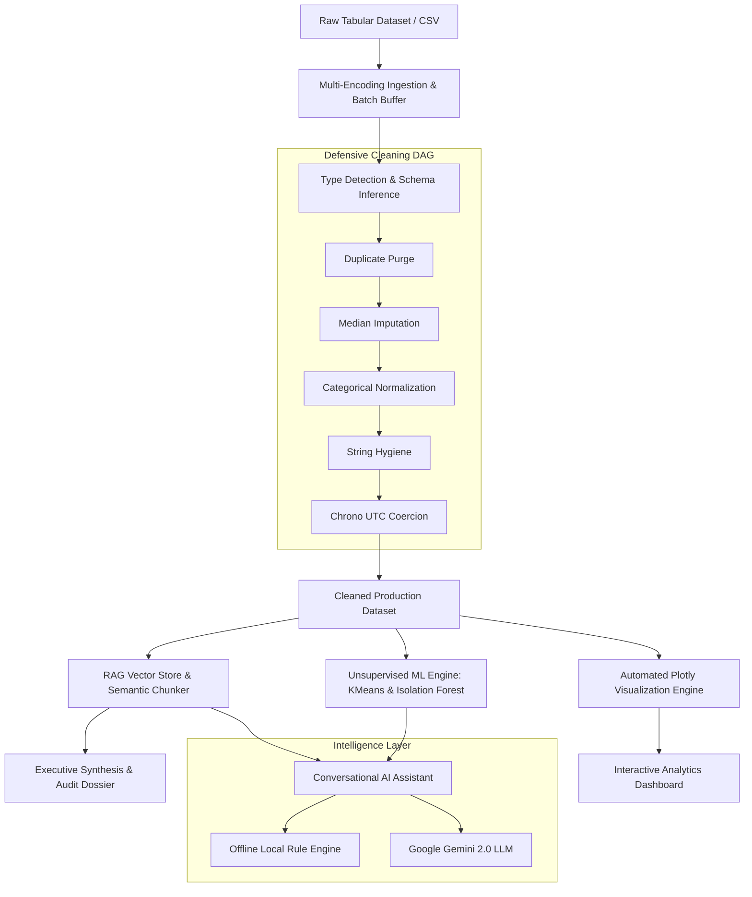

# ⚡ InsightAnalyst AI — Enterprise Data Diagnostics & Autonomous RAG Analytics Engine

[](https://share.streamlit.io/)
[](https://www.python.org/downloads/)
[](https://opensource.org/licenses/MIT)
[](https://github.com/psf/black)

**InsightAnalyst AI** is an enterprise-grade automated data diagnostic, cleaning, machine learning discovery, and Retrieval-Augmented Generation (RAG) conversational platform built with **Streamlit**, **scikit-learn**, and **Google Gemini AI**. 

It enables business leaders, data engineers, and analysts to transform raw, messy tabular datasets into production-grade cleaned datasets, actionable statistical insights, interactive visual analytics dashboards, and executive dossiers in seconds.

---

## 🌟 Key Highlights & Capabilities

### 1. 📊 Automated Executive Diagnostic & RAG Synthesis
* **RAG-Powered Briefings**: Ingests raw tabular data, segments records into semantic vector chunks, and generates context-grounded executive summaries.
* **Dataset Health & Hygiene Scoring**: Real-time 0–100 quality telemetry evaluating missingness, duplicate rates, schema anomalies, and variance health.
* **Exportable Dossiers**: One-click download of rich HTML executive audit dossiers and Markdown reports.

### 2. 🛡️ Defensive Automated Cleaning Pipeline & DAG Telemetry
* **Step 1: Duplicate Scan & Purge**: Fast deduplication across high-dimensional feature spaces.
* **Step 2: Numeric Imputation**: Robust median-strategy imputation preserving distribution skewness.
* **Step 3: Categorical Normalization**: Mode imputation paired with explicit sentinel labeling (`"Unknown"`).
* **Step 4: String Hygiene**: Automated stripping, whitespace compaction, and uniform casing.
* **Step 5: Chrono UTC Datetime Coercion**: Multi-format datetime parsing with ISO-8601 UTC schema enforcement.
* **Interactive DAG Telemetry**: Step-by-step latency tracking, cell modification counts, and full Raw vs. Clean data diffs.

### 3. 📈 Intelligent Visual Dashboard & Custom Sandbox
* **Automated Visual Grid**: Auto-generated numeric distributions, categorical count distributions, time-series trends, and correlation heatmaps.
* **Natural Language Query Filtering**: Filter your dataset in plain English (e.g. *"Show records with revenue above 5000 in California"*).
* **Custom Visual Explorer Sandbox**: Interactive multi-axis sandbox supporting Bar, Scatter, Line, Box, Histogram, and 3D Scatter plots with configurable groupings and aggregations.

### 4. 🧠 Unsupervised Machine Learning Engine
* **K-Means Clustering & Silhouette Optimization**: Automated customer/entity segmentation with 2D Principal Component Analysis (PCA) projection.
* **Isolation Forest Anomaly Detection**: Configurable contamination threshold ($\alpha$) to isolate anomalous data points, fraud indicators, and operational outliers.
* **Covariance & Correlation Matrices**: Multi-feature Pearson correlation analysis.

### 5. 💬 Conversational AI Analyst with RAG & Gemini
* **Conversational Interface**: Query your data with natural language to generate instant answers, data slices, and charts.
* **Hybrid Intelligence Engine**: Works offline with a deterministic heuristic engine or connects to **Google Gemini 2.0 / 1.5** for deep multi-hop reasoning.
* **Interactive Chat Artifacts**: Dynamic generation of Plotly charts, data preview tables, and ready-to-run SQL/Python snippets right inside the chat stream.
* **Quick-Action Prompts**: One-click shortcuts for Top Revenue Drivers, Distribution Plots, Anomaly Risk Audits, Strategic Recommendations, and SQL Generation.

### 6. 🚀 Scalable Ingestion & Fault-Tolerant File Handling
* **Batch Stream Processing**: Memory-efficient batch chunking capable of ingesting large multi-gigabyte datasets without memory exhaustion.
* **Multi-Encoding Fallback Engine**: Automatic encoding detection (`utf-8`, `latin-1`, `cp1252`, `iso-8859-1`) to eliminate byte decode crashes.

---

## 🏗️ Architecture & Pipeline Overview



---

## 📂 Project Structure

```text
├── app.py                      # Main Streamlit Application & Multi-Tab Interface
├── requirements.txt            # Python Dependencies
├── .streamlit/
│   └── config.toml             # Custom Enterprise UI Theme & Server Configurations
├── sample_data/                # Built-in Datasets for Instant Demo & Testing
│   ├── sample_healthcare.csv
│   ├── sample_marketing.csv
│   └── sample_sales.csv
└── utils/                      # Modular Business Logic & Processing Engines
    ├── __init__.py
    ├── ai_assistant.py         # Conversational Assistant with RAG & Gemini API
    ├── batch_processor.py      # High-Throughput Batch Streamer & Multi-Encoding Parser
    ├── cleaner.py              # 5-Stage Defensive Cleaning DAG & Telemetry Tracker
    ├── dashboard.py            # Plotly Visualization Components & Custom Sandbox
    ├── ml_engine.py            # K-Means, PCA, & Isolation Forest Anomaly Detection
    ├── query_engine.py         # Natural Language Rule-Based Dataframe Filter
    ├── rag_engine.py           # Vector Indexing, Semantic Chunking & Similarity Search
    ├── summarizer.py           # Executive Summary Generator & HTML Dossier Exporter
    └── type_detector.py        # Robust Column Type & Schema Detection
```

---

## ⚡ Quickstart & Local Setup

### 1. Clone the Repository
```bash
git clone https://github.com/Meetrao/datathon.git
cd datathon
```

### 2. Set Up Virtual Environment
```bash
# Create virtual environment
python3 -m venv venv

# Activate on macOS/Linux:
source venv/bin/activate

# Activate on Windows:
# venv\Scripts\activate
```

### 3. Install Dependencies
```bash
pip install --upgrade pip
pip install -r requirements.txt
```

### 4. (Optional) Set Google Gemini API Key
To enable advanced Gemini reasoning for the conversational assistant, set the environment variable or enter it directly in the app sidebar:
```bash
export GEMINI_API_KEY="your-gemini-api-key"
```

### 5. Launch the Application
```bash
streamlit run app.py
```
Open [http://localhost:8501](http://localhost:8501) in your browser.

---

## ☁️ Deployment Guide

### Deploying to Streamlit Community Cloud (Recommended)

1. Fork or push this repository to your GitHub account (`Meetrao/datathon`).
2. Visit **[share.streamlit.io](https://share.streamlit.io)** and click **"Create app"**.
3. Select:
   * **Repository**: `Meetrao/datathon`
   * **Branch**: `main`
   * **Main file path**: `app.py`
4. *(Optional)* Under **Advanced settings > Secrets**, add your API key:
   ```toml
   GEMINI_API_KEY = "your-api-key-here"
   ```
5. Click **Deploy!**

---

## 🛠️ Tech Stack & Libraries

| Category | Technologies / Libraries |
| :--- | :--- |
| **Frontend & UI** | Streamlit, HTML5, Custom Enterprise CSS |
| **Data Processing** | Pandas, NumPy, PyArrow |
| **Machine Learning** | Scikit-Learn (K-Means, PCA, IsolationForest, StandardScaler) |
| **Vector Search & RAG** | Scikit-Learn TF-IDF, Cosine Similarity, FAISS-CPU |
| **Data Visualization** | Plotly Express, Plotly Graph Objects |
| **LLM & Generative AI**| Google Generative AI (`google-generativeai`), LangChain |

---

## 📄 License

This project is licensed under the MIT License. See the [LICENSE](LICENSE) file for details.
